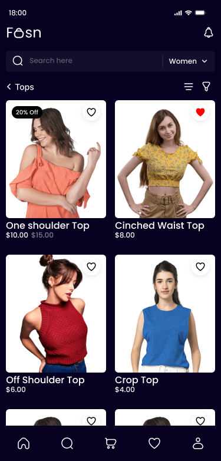

# Projeto eCommerceFashionStore para App Mobile 

Projeto Pessoal de uma ***Loja de roupa*** usando desing do ***Figma community*** com o intuito de usar tecnologias e aprimora habilidades no desenvolvimento Mobile usando ***Tecnolgias Hibidas*** para Ambos os dispositivos ***Ios*** e ***Android***.

## Índice

- [Tecnologias e Ferramentas Utilizadas](#tecnologias-e-ferramentas-utilizadas)
- [Desing do Projeto No Figma Community](#Desing-do-Projeto-No-Figma-Community)
- [Pq Usar o FireBase no Projeto Expo Go](#Pq-Usar-o-FireBase-no-Projeto-Expo-Go)
- [Pré-requisitos](#pré-requisitos)
- [Execução do Projeto](#execução-do-projeto)

## Tecnologias e Ferramentas Utilizadas

<div style="display: inline_block"  align="center">
  
  
  
  
  
  
  
</div>
<br>

- [React Native](#https://reactnative.dev/docs/environment-setup)
- [Expo](#https://docs.expo.dev/)
- [Expo Go](#https://expo.dev/go)
- [react-navigation](#https://reactnavigation.org/docs/getting-started/)
- [vector-icons](#https://icons.expo.fyi/Index)
- [styled-components](#https://styled-components.com/docs)
- [FireBase](#https://firebase.google.com/?hl=pt-br)

## Desing do Projeto No Figma Community

Para esse projeto eu em especial prefirir usar um Design pronto no intuito de ser algum mais focado no desenvolvimento Mobile e conceitos importantes a serem aplicado para o projeto.

<div style="display: inline_block" align="center">

<h4>Telas inicial juntamente com a navegacao do app | Telas relacionadas ao user e produtos</h4>





</div>

<br>

## Pq Usar o FireBase no Projeto Expo Go

<br>
<div style="display: inline_block" align="center">


</div>
<br>

Foi usando o ***FireBase*** no projeto para implementar raz vários benefícios, especialmente se você está desenvolvendo ***aplicativos móveis*** e precisa de ***funcionalidades de back-end*** robustas e escaláveis. 

Com o ***Firebase Authentication***, é fácil implementar uma solução segura e confiável para autenticação de usuários usando métodos como ***e-mail/senha*** e ***logins sociais***.

O ***Firebase Realtime Database*** e o Firestore permitem armazenar e sincronizar dados em tempo real, ideal para aplicativos que necessitam de ***atualizações instantâneas***, como chats e redes sociais. 

O ***Firebase Storage*** oferece uma solução escalável e segura para armazenar e servir conteúdo gerado pelos usuários, como ***fotos*** e ***vídeos***.

### resumindo...

A integração com ***Expo*** é facilitada pela boa ***documentação*** e suporte da ***comunidade***, acelerando o desenvolvimento e simplificando a manutenção. Proporciona uma série de ***soluções integradas*** que funcionam bem juntas, permitindo que os desenvolvedores criem uma ***ótima experiência*** de usuário com menos preocupação com a ***infraestrutura***.

## Pré-requisitos

Algums Pré-requisitos importantes para vc poder rodar o projeto na sua maquina local seria vc ter instalado as seguintes ferramentas que sao: 

- [Node.js](#https://nodejs.org/en/download/package-manager/current)
<br>
ambiente de execução JavaScript que permite executar código JavaScript fora de um navegador
<br>
<br>

- [Expo Go](#https://expo.dev/go)
<br>
aplicativo móvel que permite testar e visualizar aplicativos React Native em desenvolvimento diretamente em dispositivos Android e iOS sem a necessidade de compilar ou instalar o aplicativo completo
<br>
<br>

- [Vs.code](#https://code.visualstudio.com/download)
<br>
editor de código-fonte leve, mas poderoso, desenvolvido pela Microsoft. É amplamente utilizado por desenvolvedores devido à sua flexibilidade, extensibilidade e excelente suporte para diversas linguagens de programação
<br>
<br>

- [Git](#https://git-scm.com/downloads)
<br>
sistema de controle de versão distribuído, que permite que desenvolvedores rastreiem as mudanças no código-fonte durante o desenvolvimento de software. Ele é amplamente utilizado por equipes de desenvolvimento para colaborar de forma eficiente e segura, mantendo o histórico de alterações e facilitando o gerenciamento de versões do software.
<br>
<br>

## Executando o Projeto de forma local 

primeiro passo para vc conseguir executar o projeto de forma local seria usando o git instalado na sua maquina para fazer um clone do projeto para alguma pasta que vc deseja fazer isso

crie uma pasta: 

<div>

</div>

<br>

Apos cria sua pasta vc vai entra no vscode para utilizar o seguint comando no terminal 

```powershell
git clone https://github.com/Igornalves/Gym_App-Mobile.git
```

Com o projeto ja estando clonado vc agora vc poder instalar todas as dependencias do projeto usando o seguinte comandado

```terminal
npm install 
```

agora com todas as dependencias instaladas vc pode executar o projeto de forma completa 

OBS:. a versao do Expo mais a do Expo Go tem que estar sincronizadas, Ex:. SDK:51 / "expo": "~51.0.22". Desta forma o seu APP vai funcinar de forma completa e local 

```
npm run start 
```

Logo apos isso vc vera uma opcao para conectar o seu APP usando o QR code para localizar o seu App rodado na rede local 

<div>

</div>

<br>

Desta forma agora vc podera usar o aplicativo e tambem fazeer alteracoes no codigo fonte do projeto.